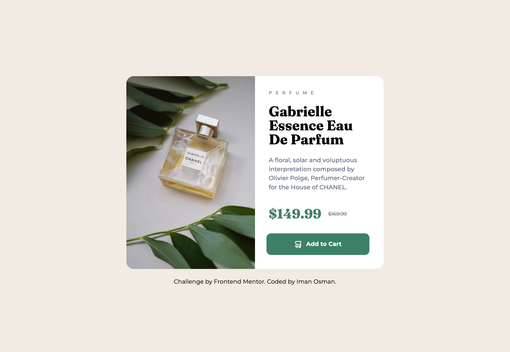

# Frontend Mentor - Product preview card component solution

This is a solution to the [Product preview card component challenge on Frontend Mentor](https://www.frontendmentor.io/challenges/product-preview-card-component-GO7UmttRfa).

## Table of contents

- [Overview](#overview)
- [The task](#the-task)
- [Approach](#approach)
- [Outcome](#outcome)
- [Built with](#built-with)
- [Feedback](#feedback)
- [Lessons](#lessons)
- [Take forward](#take-forward)

## Overview

This challenge required that I use a mobile-first approach to produce a product-preview card for a perfume.

## The task

This required that I change my workflow from desktop to mobile-first.

## Approach

I approached the task with a Flex layout in mind. This design is similar to previous easier ones where flex was sufficient. However, I came to find that I had to depend on a combination of Flex rows _and_ columns, which got a bit finnicky. I wonder if Grid would have been a better option.

## Outcome

The outcome is true to the design and functions well responsively. Although, it took me longer than I hoped. This was mainly due to the media queries that I added for the desktop design, which was structured differently than the mobile. Since I had done mobile first, I didn’t anticipate the amount of restructuring it would take and that slowed me down a bit. But I’d say the outcome itself is successful.

:jigsaw: Live Site URL: (https://i000o.github.io/fem-product-preview-card/)  
:pencil2: Solution URL: (https://www.frontendmentor.io/solutions/perfume-mobile-first-kfsuDZ_cU-)

## Built with

:gear: Semantic HTML5 markup  
:gear: CSS Flex and Floats
:gear: Mobile-first workflow

## Feedback

I haven’t received any significant feedback from peers on this project, but I have perused Frontend Mentor to see if/how people used Grid instead of Flex. Some did, but it seems that Flex is an acceptable option to. I think simply, for my workflow, I’d be curious to try as aligning content was finnicky using Flex.

_“Good job”_

Source: https://www.frontendmentor.io/solutions/perfume-mobile-first-kfsuDZ_cU-

## Lessons

1. `'Art direction’` - A concept used to swap out loaded images from the browser for efficiency and responsive design. I learnt about the `<picture>` tag in this instance, as I’d only previous used ``. This took some research, but was rewarding to understand in the end. I shared my code snippet with other learners who struggling with the same thing on this task.
2. `border-bottom-right-radius: 0;` - How to target specific corners of a border-radius to create the straight line on one side for the desktop version. Tiny, but cool.
3. `<s>` - HTML strikethrough. Super easy, super useful. Anything I don’t need to do in CSS, I don’t want to.
4. This was my first time using Floats! - I know it’s not readily done, but I can see how it’d be useful in specific cases.

**Extras**

5. `text-transform: uppercase;`
6. `letter-spacing: .5rem;`

## Take forward

:grey_exclamation: I’d like to get more confident with more complex layouts that include rows/columns in tandem.  
:grey_exclamation: Learning about ‘art direction’ was really useful  
:grey_exclamation: I found mobile-first difficult but I’ll try it a couple more times before I decide on a personal workflow
